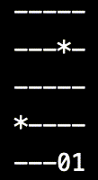
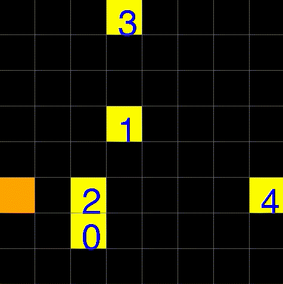

# DeMAC Framework

The Decentralized Multi-Agent Coordination (DeMAC) Framework is a lightweight tool designed to easily coordinate multiple agents with decentralized policies in a shared multi-agent environment. This framework targets anyone looking to quickly set up a robust multi-agent environment and train/test workflow. 

This open source project is currently in its infancy, and certainly has many issues. Thus, any work to extend this project's functionality is welcome.

## How it works


 We start with a [**coordinator**](./demac/src/demac/demac_coordinator.py) thread that hosts a message passing queue server for agents to send requests to when they want to interact with the shared environment. Once the coordinator receives a request from every agent, it pools and simultaneously sends their requests to the shared environment. Once the environment returns a pooled response mapped to each agent, the coordinator will extract out each response and return it to the corresponding agent. 

Since the coordinator of the DeMAC framework acts as a middle man, the user is responsible for defining the learning algorithms/agents on the client-side, and shared environment on the server-side. It is important that the shared environment extends the [**MARLEnvInterface**](./demac/src/demac/marl_env_interface.py) interface, and individual agents only have access to a wrapper environment instance defined by [**AgentEnvWrapper**](./demac/src/demac/demac_agent_env_wrapper.py). Both the interface and wrapper environment classes use [gym](https://gym.openai.com/) because it is a great toolkit to build well-defined environments. A more detailed guide to coding with the DeMAC framework can be seen in the following section.

## How to begin using DeMAC

First, create a shared environment that extends the [**MARLEnvInterface**](./demac/src/demac/marl_env_interface.py) interface, initializing any instance variables or functions in the interface. Then, create a main file similar to [main.py](./main.py) that defines the workflow for learning/evaluating multiple agents. 

The [sample envs](./sample_envs) folder gives a couple examples (trivial, meteor, gridnav) for how to define the shared environment. [main.py](./main.py) gives a good example for how to set up the DeMAC workflow (e.g. initializing the coordinator, linking the coordinator to the agents, initializing each agent with a wrapper environment, etc.) and define the learning/evaluating workflow.

## Installation
To install, first install the following dependencies:
* [Docker](https://docs.docker.com/engine/install/)
* [RabbitMQ](https://rabbitmq.com/download.html)
* [Anaconda](https://docs.anaconda.com/anaconda/install/) (Optional)

Docker will help us install RabbitMQ, which is how we manage our message queue system in DeMAC. Anaconda is an optional dependency to set up a virtual environment with the instructions below.
  
Assuming you have the 3 dependencies above, setting up your virtual environment is simple. Simply run the following:

```
conda create -n demac python=3.7
conda activate demac
pip install -r demac/requirements.txt
```

If you do not want to install Anaconda (a very large but useful package!), and prefer to use Python's built-in virtual environment system, run the following:
```
python -m venv venv
source venv/bin/activate
pip install -r requirements.txt
```

## Usage
For the given repo, we will use the sample env `MeteorEnv` as an example of how to use DeMAC.

To train:
```
python main.py --env meteor
```

To test:
```
python main.py --env meteor --test <model file name>
```

## Sample Environments
### Trivial
A minimum implementation of a shared environment using the DeMAC framework. This contrived example can be used as a basic reference for how to get set up with the shared environment, and run quick tests. 

### Meteor


This is a game where a group of agents must avoid falling meteors from the sky. Agents live on the last row of an NxN grid, and can observe meteors falling in intervals from the top row. The collective goal of the agents is to avoid the meteors for as long as possible.

Agents are able to move left and right, but are not on top of each other. Hence, the challenge is for the agents to learn cooperative behavior (e.g. moving for another agent to dodge a meteor even if the current agent is out of harm's way) to maximize the collective return.

### GridNav


This task involves a group of agents that must navigate an NxN grid and reach some goal without colliding into each other or into obstacles. The collective goal of the agents is to reach the goal as quickly as possible; there is a big bonus for an agent that reaches the goal, and big penalty for colliding agents. 

Agents are able to move up, down, left, and right, but will collide if they move on top of a spot that is occupied by another agent or obstacle.
